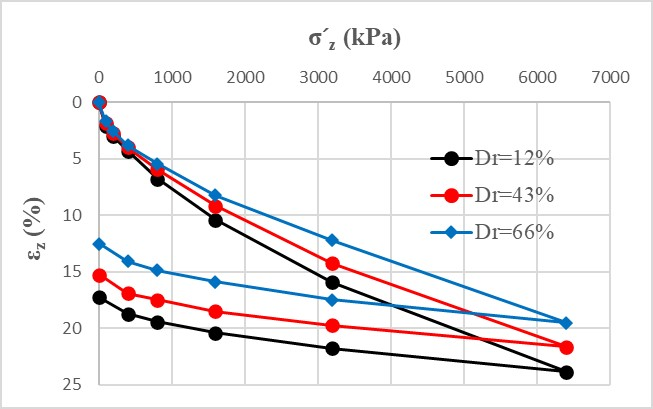
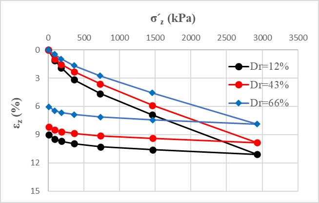
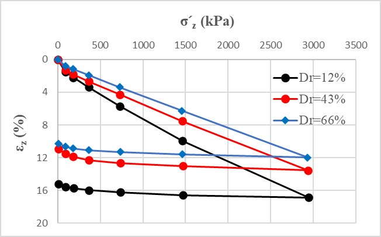

Notation:

- $$\epsilon_z$$ = Vertical strain
- $$\sigma^\prime_z$$ = Effective vertical stress
- $$Dr$$ = Initial relative density

{: .note} 
Particle size distribution curves after tests were also included in test results.

**Sand Type: CS2-1**
- $$H$$ = Sample height ($$H=20$$ mm)
- $$D$$ = Sample diameter ($$D=79.8$$ mm)

**Sand Type: CS2-1**
- $$H=$$Sample height ($$H=80$$ mm)
- $$D=$$Sample diameter ($$D=100$$ mm)

**Sand Type: CS2-2**
- $$H=$$Sample height ($$H=80$$ mm)
- $$D=$$Sample diameter ($$D=100$$ mm)

---

**Contributors**：Kaifeng Zeng; Zhen-Yu Yin; Huabei Liu

**Institutions**: The Hong Kong Polytechnic University; Huazhong University of Science and Technology   

**Publications in journal**: Zeng, K. F., and H. B. Liu. 2023. “Experimental study on the timedependent oedometric compression behavior of calcareous sand.” J. Geotech. Geoenviron. Eng. 149 (5): 04023025. https://doi.org/10.1061/JGGEFK.GTENG-10739.