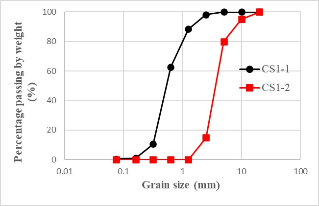
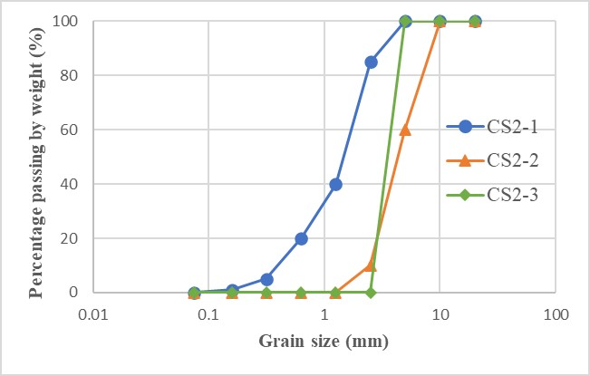
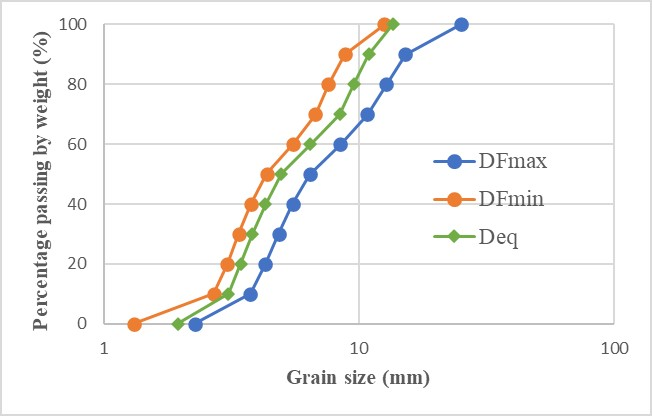
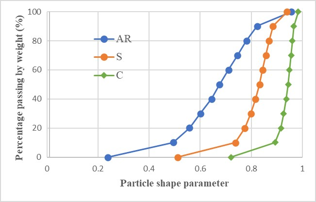
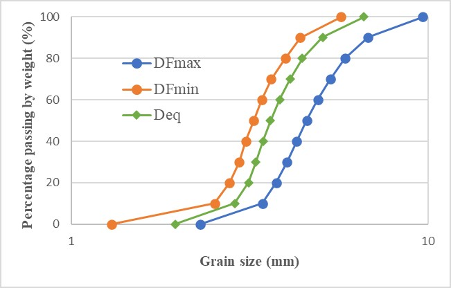
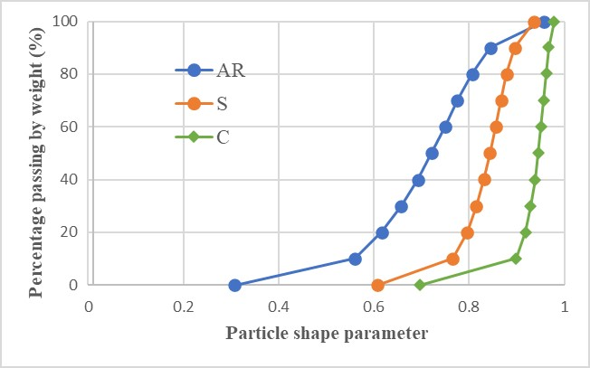
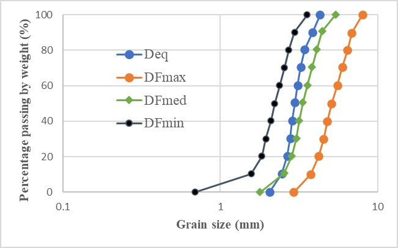
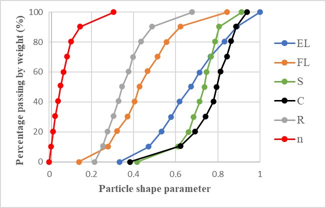
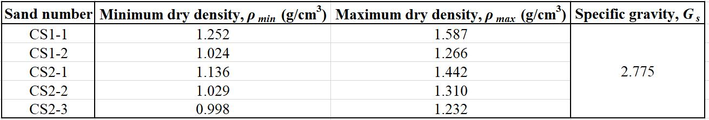

Five different grain size distributions were selected for the tests,tests, and they were divided into two groups. 

- **Group No. 1:** CS1-1 and CS1-2 
- **Group No. 2:** CS2-1, CS2-2 and CS2-3

### 1. Particle size distributions obtained from sieve analysis

### 2. Particle size and shape distributions obtained from 2D image analysis

**Notation:**
- $$D_{Fmax}$$: Feret diameter-Max            
- $$AR$$: Aspect ratio; 
- $$D_{Fmin}$$: Feret diameter-Min
- $$S$$: Sphericity; 
- $$D_{eq}$$: Equivalent diameter
- $$C$$: Convexity

#### 2.1. CS2-2

#### 2.2. CS2-3

### 3. Particle size and shape distributions obtained from 3D X-ray micro-computed tomography (μCT)

Notation: 

- $$D_{Fmax}$$: Feret diameter-Max
- $$EL$$: Elongation
- $$R$$: Roundness
- $$D_{Fmed}$$: Feret diameter-Med
- $$FL$$: Flatness
- $$n$$: Intra-particle porosity
- $$D_{Fmin}$$: Feret Diameter-Min
- $$S$$: Sphericity 
- $$D_{eq}$$: Equivalent Diameter
- $$C$$: Convexity

#### 3.1. CS2-3

### 4. Minimum and maximum dry density, and specific gravity

